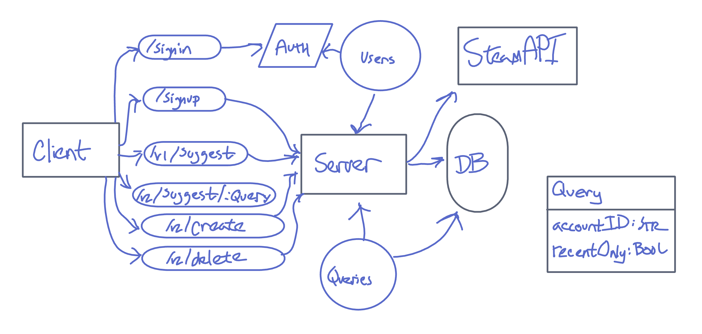

# Playtime Suggester

This API server interacts with the Steam API to retrieve lists of games based on criteria provided by the user.  The intent is for this server to provide data to a front-end app which would display a random selection of games within the provided criteria.

Deployed Site: https://playtime-suggest-api.herokuapp.com/

Latest Pull Request: https://github.com/AndresMillsGallego/playtime-suggest-api/pull/1

## Installation
* Clone this repository onto your local machine
* cd into ./playtime-suggest-api
* Install package dependencies with npm install

## Authors

[Andres Mills Gallego](https://github.com/AndresMillsGallego) and [Micha Davis](https://github.com/Micha-L-Davis)

## Routes

* POST : /signin
    * Parameters
        * username
        * password
    * Response
        * 201 if valid.

* POST : /signup
    * Parameters
        * username
        * password
    * Response
        * 500 if invalid
        * 201 if valid.

* GET : api/v1/suggest
    * Response
        * 200 and an array of objects representing all Steam games

* GET : api/v2/suggest/:limiter
    * Parameters:
        * The name of an existing limiter
    * Response:
        * 200 and a list of games filtered by the limiter

* POST : api/v2/create
    * Parameters:
        *  name of the limiter
        *  BOOL flags for limits (currently: recentlyPlayed)
    *  Response:
        * 200 and the created limiter as an object

* DELETE : api/v2/delete/:limiter
    * Parameters
        * The name of an existing limiter      
    * Response
        * 200 and a confirmation of deletion    

* PATCH : api/v2/update/:limiter
    * Parameters
        * The name of an existing limiter      
    * Response
        * 200 and the updated limiter as an object
